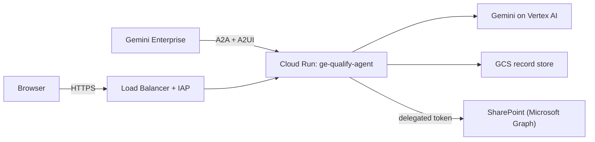

# GE Qualify Agent

Qualifies a Gemini Enterprise use case **before** it becomes a delivery
commitment: what it is worth, whether it is technically feasible, and where it
ranks against the rest of the portfolio.

It ships in two forms:

- **Qualification agent**: an A2A agent with an interactive A2UI form,
  running on Cloud Run and registered in Gemini Enterprise. This is the main
  part of the repo (`qualify/`).
- **Two standalone skills**: `ge-intake-business` and `ge-review-tech`, for
  running the same interviews as plain Gemini Enterprise skills (`skills/`).

> **Status: early access.** Usable today and under active iteration.
> Interfaces and templates may change.

## Why this exists

Existing tooling grades ramp plans for accounts that have **already** bought
Gemini Enterprise. Nothing covered the pre-sale question: is this use case a
fit, what is it worth, and what would it take to land it? This repo fills that
gap and produces documents an FDE can pick up directly. It implements the
[GE App Use Case Discovery Framework](docs/framework.md).

---

## The qualification agent

The agent interviews a stakeholder in Gemini Enterprise chat, one stage per
turn, and fills a form next to the conversation as answers come in. Every
field it proposes is shown for the user to confirm or correct.

| Phase | Stages | Output |
| :--- | :--- | :--- |
| 1. Business intake | Problem and users · Effort and value · Data and systems · Ownership and next steps | Business Value Brief: annual hours saved, capability tier (Levels 1–6) |
| 2. Technical review | Systems and data landscape · Infrastructure and network · Security, IAM and governance · Data grounding and model routing · Operational readiness | Technical Architecture Dossier: 22-subcriteria readiness score, feasibility profile, access checklist |
| 3. Portfolio | Ranks every qualified use case by value and feasibility | Portfolio report with four quadrants |

A finished business brief can be picked up later for its technical review:
type `technical review` or `show pending documents to review`. Type `help` in
the chat for the full list of commands.

### Where results go

- **Records**: every session is saved to a GCS bucket (`QUALIFY_GCS_BUCKET`).
  Portfolio ranking and the pending-review list read from it.
- **SharePoint (optional)**: the user signs in with Microsoft through a signed,
  per-conversation link, and the brief, dossier and portfolio report are
  written to a shared folder under their own identity. Set `SIGNIN_CARD=0` to
  hide the sign-in prompt where testers have no account in the tenant; saving
  stays available by typing `save to sharepoint`.
- A Google Drive connector(WIP).

### Architecture



- **Access**: only the Gemini Enterprise and IAP service agents may invoke
  the Cloud Run service; `allUsers` is not an invoker. The app also checks
  that A2A calls come from Gemini Enterprise's service agent
  (`qualify/agent/ge_auth.py`, `A2A_AUTH_MODE`).
- **Browser path**: the Microsoft sign-in pages (`/auth`, `/auth/callback`)
  are reached through the Load Balancer, behind IAP.
- **Secrets**: the Microsoft client secret and the link-signing key live in
  Secret Manager and are mounted at deploy time.

### Code layout

| Path | Contents |
| :--- | :--- |
| `qualify/agent/` | A2A server, turn engine, Phase 1 → 2 handover, caller verification |
| `qualify/a2ui/` | Form compiler, actions, sign-in card, A2UI schema validation |
| `qualify/packs/` | Interview definitions: `business.yaml`, `tech.yaml` |
| `qualify/scoring/`, `qualify/export/` | Tier, technical and portfolio scoring; brief, dossier and report rendering |
| `qualify/connectors/` | Storage layer: SharePoint, Google Drive, token vault, signed links |
| `qualify/sinks/` | Session and record stores (local or GCS) |
| `agent/instructions.md` | System instruction; the capability grounding skill is appended to it |
| `scripts/` | Deploy, registration and Load Balancer scripts |

### Run locally

```bash
uv sync
uv run pytest -q                                  # unit tests
HOST=127.0.0.1 SHAREPOINT_MOCK=1 uv run start     # serves on http://127.0.0.1:8080
```

`SHAREPOINT_MOCK=1` writes documents to `.data/sharepoint_mock/` instead of
calling Microsoft Graph. Model access uses your `gcloud` Application Default
Credentials and the settings in `.env` (`GOOGLE_CLOUD_PROJECT`, `MODEL`, …).

### Deploy

```bash
scripts/setup_lb.sh       # once: Load Balancer, managed cert, IAP
scripts/deploy.sh         # build and deploy to Cloud Run, set invokers
scripts/register_ge.sh    # once: register the agent in Gemini Enterprise
scripts/sync_ge_agent.sh  # after agent card changes: refresh the GE registration
scripts/smoke_test_auth.sh
```

`deploy.sh` reads `.env`. Useful overrides: `A2A_AUTH_MODE=enforce|log`,
`SIGNIN_CARD=0|1`, `MAX_INSTANCES`.

---

## The standalone skills

| Skill | Phase | Interview | Deliverable |
| :--- | :--- | :--- | :--- |
| `ge-intake-business` | 1 — Front office | 4 stages, 5 turns | Business Value Brief |
| `ge-review-tech` | 2 — Back office | 5 stages, 6 turns | Technical Architecture Dossier & Access Checklist |

Download and add them to Gemini Enterprise:

- [`ge-intake-business`](https://github.com/giuliosalierno/ge-qualify-agent/releases/latest/download/ge_intake_business.zip) ([source](skills/ge_intake_business/SKILL.md))
- [`ge-review-tech`](https://github.com/giuliosalierno/ge-qualify-agent/releases/latest/download/ge_tech_review.zip) ([source](skills/ge_tech_review/SKILL.md))

Both run as a consultative interview, **one stage per turn**. On turn 1 the
skill transfers a working draft to the Canvas agent and starts questioning;
every unverified field stays a literal `⚠️ [Pending Stage X Discovery]`
placeholder until the customer confirms it. The final turn replaces every
placeholder with verified facts. Run them in order: the Business Value Brief
from phase 1 is the input to phase 2.

### `ge-intake-business` — business intake and value qualification

1. **Business needs & user stories** — problem description, as-is workflow, user
   personas and BU, data sources and integrations needed.
2. **Value realization & hours-saved sizing** — users (U), weekly task frequency
   (T), baseline minutes per task (M), annualized at a 60% acceleration
   benchmark over 50 work weeks.
3. **GE App agentic capabilities needed** — Three-Tier Delivery Ladder fit:
   Tier 1 out-of-the-box, Tier 2 low-code, Tier 3 pro-code.
4. **Execution & sponsorship** — business owner, executive sponsor, production
   catcher team, primary adoption KPI.

### `ge-review-tech` — technical architecture and security review

1. **Systems & data landscape** — repositories, programmatic interfaces, schema
   readiness, data freshness.
2. **Infrastructure & network baseline** — hosting, transit path to Google Cloud
   (HA-VPN, Interconnect, PSC, public HTTPS), firewall and proxy constraints.
3. **Security, IAM least-privilege & governance** — user and service auth, data
   classification, residency, cloud processing policy.
4. **Data grounding security & model routing** — document-level ACL
   preservation, citation provenance, Flash vs Pro model profile.
5. **Operational readiness & prerequisites** — named technical owners, GCP
   landing zone status, Sprint #1 prerequisites.

Output: a Technical Readiness Score (0–100%), a Feasibility Profile of **Pure GE
App**, **Custom Agent in GE App** or **Blockers / High Risk**, and an Access
Checklist.

### Packaging and evaluation

```bash
python3 skills/package_skills.py   # rebuild the zips (repo root, git-ignored)
python3 skills/run_eval.py         # skill verification tests
```

`skills/ge_capability_grounding/` is not distributed on its own: the agent
appends it to its system instruction, and it ships in the container.

---

## Documentation

| Document | What it covers |
| :--- | :--- |
| [`docs/framework.md`](docs/framework.md) | The GE App Use Case Discovery Framework; code comments cite it by line |

Design notes, implementation plans and integration findings live in a local,
git-ignored `doc/` folder and are not published.
