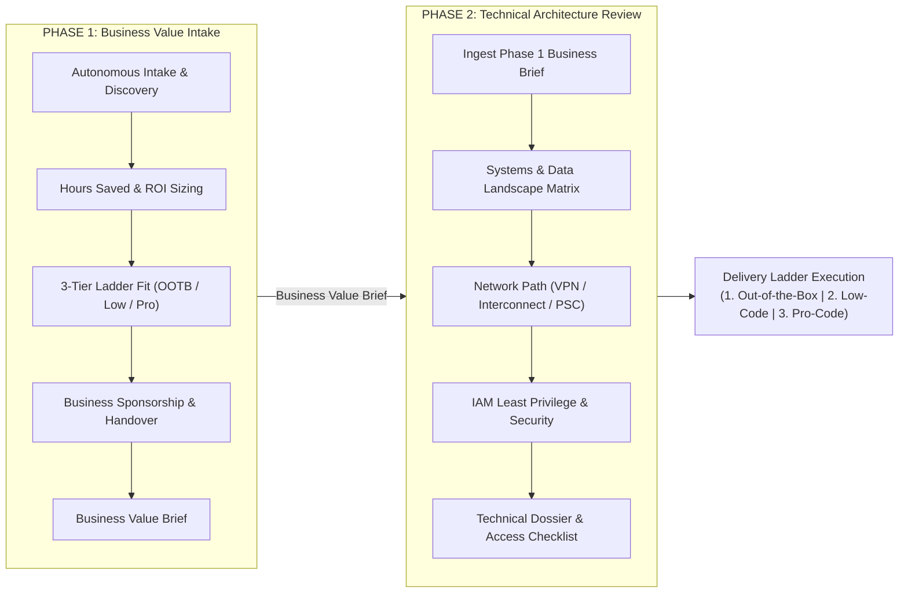
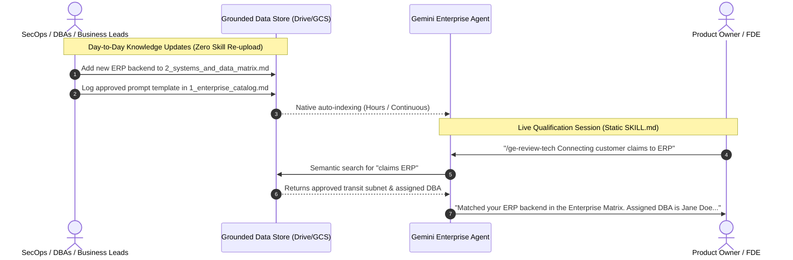

# Gemini Enterprise Opportunity Qualification Skills

An Agent Skill suite providing conversational agents and coding assistants with a structured, methodology to qualify customer opportunities for **Gemini Enterprise**.

Rooted in the **Gemini Innovation Center Blueprint**, this suite transitions organizations from decentralized chaos into an industrialized AI factory using a **Dual-Phase Operating Model** and a **Three-Tier Delivery Ladder**.

---

## Operating Model: Dual-Phase Qualification Workflow

The qualification lifecycle is organized into two sequential, collaborative phases:



### The Three-Tier Delivery Ladder
1. **Tier 1: Out-of-the-Box Solutions:** Standard Gemini Enterprise app with native connectors (Drive, BigQuery, Jira, Confluence, Salesforce). Turnkey deployment.
2. **Tier 2: Low-Code Solutions:** Tailored system prompts, Agent Builder grounding, and enterprise skill library templates.
3. **Tier 3: Pro-Code Solutions:** Custom ADK Python agents on Cloud Run/Agent Runtime with hybrid networking (Cloud VPN / Interconnect), transactional writes, and private microservices.

### Sequential Phase Handover
- **Phase 1 (Business Intake):** Conducted by business sponsors and customer engineers to establish user friction, quantify annualized hours saved, classify delivery tier, and produce the **Business Value Brief**.
- **Phase 2 (Technical Review):** Conducted by architects and security specialists starting directly from the **Business Value Brief**. It maps production systems, validates hybrid network routes, checks IAM least privilege, and compiles the **Technical Architecture Dossier** and **Access Checklist**.

### Progressive Working Draft (Template-First) Cadence
Even if the user pastes extensive notes, full specifications, or attaches complete documentation upfront, both skills (`ge-intake-business` and `ge-review-tech`) adopt a **Progressive Working Draft** model:
- **Turn 1 Working Draft Initialization:** The agent immediately generates the `# Business Value Brief [WORKING DRAFT]` or `# Technical Architecture Dossier [WORKING DRAFT]` artifact, pre-populating known facts and marking unverified sections with explicit `> ⚠️ [Pending Stage X Discovery]` tags. In that very same response, it launches Stage 1 interview questions.
- **Section-by-Section Progressive Refinement:** In each turn, the agent confirms findings for the active section, outputs an updated section snippet for the draft, and probes the next pillar to uncover operational realities (hidden queues, ACLs, DBAs, firewalls).
- **Gated Final Sign-Off:** The final signed-off deliverable (with verified ROI calculations, Technical Readiness Scores, and final delivery tier) is emitted only after all stages have been systematically reviewed and confirmed.

---

## Skill Suites & Package Formats

Gemini Enterprise currently supports skills composed of a single `SKILL.md` file without external scripts or directory dependencies. To serve both native Gemini Enterprise and tool-augmented developer environments, this repository provides:

| Skill Package | Scope & Persona | Target Runtime | Trigger Command |
| :--- | :--- | :--- | :--- |
| **`ge_intake_business.zip`**<br>([`skills/ge_intake_business/`](skills/ge_intake_business/SKILL.md)) | **Phase 1: Business Value Intake**<br>Intake, user pain, hours saved, 3-tier classification, Business Value Brief generation. | Native Gemini Enterprise UI (Single `SKILL.md`) | `/ge-intake-business` |
| **`ge_tech_review.zip`**<br>([`skills/ge_tech_review/`](skills/ge_tech_review/SKILL.md)) | **Phase 2: Technical Review**<br>Ingests Phase 1 doc, systems matrix, Cloud VPN/Interconnect, IAM, Technical Dossier & Checklist. | Native Gemini Enterprise UI (Single `SKILL.md`) | `/ge-review-tech` |
| **`ge_qualify_skill.zip`**<br>([`skills/ge_qualify/`](skills/ge_qualify/SKILL.md)) | **Full Multi-Agent Foundation**<br>Deterministic Python scripts, modular references, and asset templates. | ADK Agents, Antigravity, Multi-Agent Systems | `/ge-qualify-opportunity` |

---

## Custom Domain Knowledge Lifecycle (Gemini Enterprise)

A major operational challenge is maintaining domain-specific knowledge (industry benchmarks, internal system inventories, network CIDRs, and prompt catalogs) without constantly modifying, re-zipping, and re-uploading `SKILL.md` files.

### The Decoupled Lifecycle Architecture

This suite separates the **Reasoning Engine** from the **Domain Knowledge Base**:

```
┌─────────────────────────────────────────────────────────────┐
│ SKILL.md (Reasoning Engine - Stable)                        │
│ - 5-Pillar discovery methodology                            │
│ - Sequential Phase 1 -> Phase 2 handover rules              │  ==> Code managed in Git
│ - Hours-saved calculation formulas                          │      (Infrequent updates)
│ - Canvas deliverable templates                              │
└─────────────────────────────────────────────────────────────┘
                             ▲
                             │ Queries at runtime via Grounding
                             ▼
┌─────────────────────────────────────────────────────────────┐
│ Grounded Data Store (Domain Knowledge Base - Dynamic)       │
│ - 1_enterprise_catalog.md (Active agents & prompt library)  │
│ - 2_systems_and_data_matrix.md (Approved backends & DBAs)   │  ==> Documents in Drive/GCS
│ - 3_network_and_security_rules.md (VPCs, VPNs, PII rules)   │      (Continuous updates)
│ - 4_value_benchmarks.md (Department & industry baselines)   │
└─────────────────────────────────────────────────────────────┘
```

* **The Skill (`SKILL.md`):** Acts as the evaluation logic. It is uploaded **once** to Gemini Enterprise.
* **The Grounded Data Store:** A live Google Drive folder or Google Cloud Storage bucket attached to the agent. Domain experts (DBAs, SecOps, Business leads) update documents directly. Gemini Enterprise automatically indexes updates with **zero skill re-uploading**.

---

### The 4 Standard Knowledge Store Documents

| Document | Purpose | Who Maintains It | Grounding Action |
| :--- | :--- | :--- | :--- |
| **`1_enterprise_catalog.md`** | Inventory of published prompts, active agents, and owners. | Innovation Center Leads | **Portfolio Discovery:** Reference inventory of published agents and prompt templates. |
| **`2_systems_and_data_matrix.md`** | Approved databases (SAP, Oracle, BigQuery), APIs, schemas, and DBAs. | Lead DBAs & System Owners | **Systems Validation:** `ge-review-tech` pre-populates interfaces, schema readiness, and owners. |
| **`3_network_and_security_rules.md`** | Approved VPC subnets, Cloud VPN/Interconnect routes, PII/HIPAA rules. | Cloud Network & SecOps Leads | **Security Clearance:** `ge-review-tech` validates transit paths and cloud data policies. |
| **`4_value_benchmarks.md`** | Baseline task minutes, volumes, and acceleration rates by department. | Business Unit Leads | **Value Sizing:** `ge-intake-business` uses verified baselines to estimate hours saved. |

---

### Ingestion & Graceful Fallback Protocols

Both skills embed explicit grounding retrieval and fallback instructions:
1. **Automated Grounding Retrieval:** The agent searches the attached data store for named systems, departments, or workflows.
2. **Graceful Fallback:** If a system or benchmark is not yet registered in the store, the agent prompts the user directly in chat:
   - *Business:* *"No baseline found in the enterprise catalog. What is your team's manual duration per task?"*
   - *Tech:* *"System [Name] is unlisted in the Enterprise Matrix. Who is the designated DBA?"*
3. **Continuous Knowledge Loop:** Unregistered systems or new benchmarks surfaced during qualification are logged into the **Access Checklist**, prompting the team to update the grounded knowledge store.

---

### Operational Lifecycle: Day 1 to Day N



1. **Day 1 (Initial Setup):** Create a dedicated Drive folder or GCS bucket with the four starter documents. Attach it as the agent's Data Store in Gemini Enterprise. Upload the skills.
2. **Day 2+ (Continuous Maintenance):** When a network route, database owner, or prompt template changes, update the document in Drive or GCS. Gemini Enterprise automatically updates its search index.
3. **Day N (Evolution to Multi-Agent ADK):** When moving to an ADK multi-agent architecture, the same documents in GCS can be queried by Vertex AI Search or read directly by specialized sub-agents.

---

## Repository Structure

```
ge-qualify-skills/
├── README.md                              # Repository overview & usage guide
├── doc/
│   ├── design_plan.md                     # Architectural design plan & Innovation Center roadmap
│   └── skill_best_practices.md            # Canonical Agent Skills guide
├── tests/
│   ├── eval_cases.json                    # EDD evaluation dataset (triggers, trajectories, rubrics)
│   ├── test_scoring.py                    # Unit tests for deterministic scoring & ROI
│   ├── package_skills.py                  # Automated packager building all zip distributions
│   └── run_eval.py                        # Evaluation runner validating all skills
├── ge_intake_business.zip                 # Standalone Front Office Business skill for Gemini Enterprise
├── ge_tech_review.zip                     # Standalone Back Office Tech skill for Gemini Enterprise
├── ge_qualify_skill.zip                   # Full modular package with Python scripts
└── skills/
    ├── ge_intake_business/                # STANDALONE BUSINESS INTAKE (Front Office)
    │   └── SKILL.md                       # Self-contained prompt with hours-saved formula & Canvas template
    ├── ge_tech_review/                    # STANDALONE TECHNICAL REVIEW (Back Office)
    │   └── SKILL.md                       # Self-contained prompt with systems matrix & Canvas template
    └── ge_qualify/                        # FULL MODULAR VERSION (Future Multi-Agent System)
        ├── SKILL.md                       # Main instruction file with tool declarations
        ├── scripts/
        │   ├── calculate_score.py         # Deterministic completeness & feasibility scoring CLI
        │   └── calculate_roi.py           # Deterministic time-savings calculator
        ├── references/
        │   ├── system_landscape_matrix.md     # Reference: legacy vs. modern backends & interfaces
        │   ├── connectivity_and_security.md   # Reference: hybrid networking, VPN/Interconnect & auth
        │   └── feasibility_indicators.md      # Reference: Pure GE vs. Custom Agent vs. Blockers
        └── assets/
            ├── discovery_dossier.md       # Output template for As-Is handover memo
            ├── access_checklist.md        # Output template for customer prerequisites
            └── value_summary.md           # Output template for time reclamation summary
```

---

## Packaging & Installation

### Quick Packaging (Build All Zips)
To build or refresh all zip archives:
```bash
python3 tests/package_skills.py
```

### 1. Gemini Enterprise (Standalone Skills)
1. Open Gemini Enterprise.
2. Navigate to your Agent settings -> **Skills**.
3. Upload the desired zip package:
   - Upload **`ge_intake_business.zip`** to enable Front Office business intake (`/ge-intake-business`).
   - Upload **`ge_tech_review.zip`** to enable Back Office architecture review (`/ge-review-tech`).

### 2. Antigravity & Coding Assistants (Full Version)
Copy the `skills/ge_qualify` folder into your agent's skill directory:
```bash
cp -r skills/ge_qualify ~/.gemini/skills/
```

### 3. ADK Agents & Multi-Agent Systems (Programmatic Loading)
Load via ADK's `SkillToolset`:
```python
from google.adk.skills import SkillToolset

skill_toolset = SkillToolset(skills_dir="skills/ge_qualify")
agent.add_toolset(skill_toolset)
```

---

## Testing & Verification

Run the automated test suite and evaluation runner to validate all skills:

```bash
# 1. Run unit tests for deterministic scripts
python3 -m unittest discover -s tests -p "test_*.py"

# 2. Run the evaluation runner (validates all skills, token limits, and scenarios)
python3 tests/run_eval.py
```
