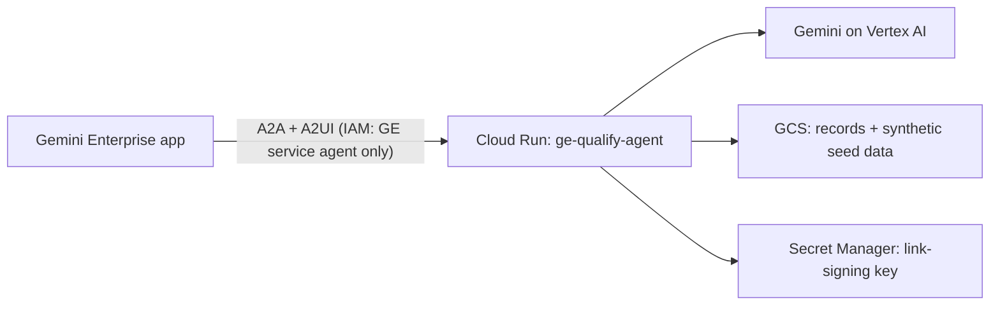

# GE Qualify Agent: go/demos Click-to-Deploy

One click deploys the qualification agent into your Argolis project and
registers it in a Gemini Enterprise app. No SharePoint, no Load Balancer, no
manual steps.

## What gets deployed



| Resource | Notes |
| :--- | :--- |
| Cloud Run `ge-qualify-agent` | Scales 0–1. Only the Discovery Engine service agent may invoke it. |
| Service accounts `*-run`, `*-build` | Least privilege. The Compute default SA is not used. |
| Artifact Registry + Cloud Build | Image built from this repo in your project. |
| GCS bucket `<project>-ge-qualify-agent` | Private. Holds sessions, records, and 3 synthetic use cases. |
| GCS bucket `<project>-ge-qualify-agent-build` | Private build staging (source uploads, deleted after 7 days). Only the build SA can read it. |
| Gemini Enterprise app `ge-qualify-agent-app-<suffix>` | Created unless `ge_engine_id` is set. The agent is registered in it. The random suffix lets you destroy and redeploy in the same project (Discovery Engine keeps deleted IDs reserved for hours). |

Takes about 10–15 minutes, mostly the image build.

## Demo script (5 minutes)

All companies and people in the seed data are fictional (Cymbal).

1. Open the Gemini Enterprise app (see the `gemini_enterprise_console_url`
   output) and pick **Qualification Agent**.
2. **Phase 1, business intake.** Type: `I want to qualify an agent that drafts
   replies to supplier invoice queries for our 30-person AP team`. Answer the
   form one stage per turn. At the end you get a Business Value Brief with
   annual hours saved and a capability level (1–6).
3. **Phase 2, technical review.** Type `technical review`. Pick
   *Claims intake triage* (seed data) or the use case you just created.
   Five stages produce a Technical Architecture Dossier and a readiness score.
4. **Portfolio.** Type `portfolio review`. Every qualified use case is
   ranked by value and feasibility into four quadrants.

Type `help` at any time for the command list.

## Run it by hand in your own Argolis project

```bash
cd click-to-deploy/demo/terraform
terraform init
terraform apply \
  -var project_id=YOUR_PROJECT -var project_name=YOUR_PROJECT \
  -var project_number=$(gcloud projects describe YOUR_PROJECT --format='value(projectNumber)') \
  -var org_id=YOUR_ORG -var gcp_account_name=you@your-argolis-domain \
  -var deployment_service_account_name=unused -var data_location=unused \
  -var secret_stored_project=unused
terraform destroy   # same -var flags; see below for what stays
```

Requires `gcloud`, `curl` and `python3` on the machine running Terraform
(image build and Gemini Enterprise registration run as `local-exec`, the same
pattern the CDP Sample_Standard_Demos template uses). In go/demos the
`org_policy/` stage runs first and enables the APIs; by hand, the demo
Terraform enables them itself.

`terraform destroy` removes everything above except: the Gemini Enterprise
licence config (no delete API; the free trial expires after a month), the
enabled APIs and service identities, and, when `ge_engine_id` points at an
existing app, the agent entry in that app (delete it in the console).

Useful variables: `ge_engine_id` (reuse an existing GE app),
`container_image` (skip the build), `model`, `seed_demo_data`,
`a2a_auth_mode`.

## Security

- No `allUsers` invoker. Cloud Run IAM admits only Gemini Enterprise's
  service agent, and the app checks the caller again (`A2A_AUTH_MODE=enforce`).
- The link-signing key is generated per deployment and stored in Secret
  Manager. Terraform state therefore contains it: keep state private.
- Dependencies are pinned with hashes (`requirements.txt`) and installed with
  `pip --require-hashes` (go/pip-install-remediation). The container runs as
  a non-root user.
- The only org policy override (`iam.disableServiceAccountCreation`) is
  restored after deployment.
- Synthetic data only. Do not paste customer data into a demo deployment.

## Optional: SharePoint

The full product saves documents to SharePoint under the user's own identity.
That needs an Entra app registration and a Load Balancer with IAP, so it is
out of scope for the one-click demo. See `scripts/` and the main README.

## Layout

| Path | Contents |
| :--- | :--- |
| `demo/terraform/base_variables.tf` | The 8 mandatory go/demos variables (from the CDP template) |
| `demo/terraform/variables.tf` | Demo settings with go/demos defaults |
| `demo/terraform/*.tf` | Demo infrastructure |
| `demo/cloudbuild.yaml` | Image build used by `build.tf` |
| `demo/scripts/register_agent.sh` | Idempotent Gemini Enterprise registration |
| `demo/seed/` | Synthetic records and their generator |
| `org_policy/project_config.json` | APIs and org policy overrides (the only file to edit there) |
| `org_policy/project_resource.tf` | CDP template, applies the JSON. **Do not edit.** |
