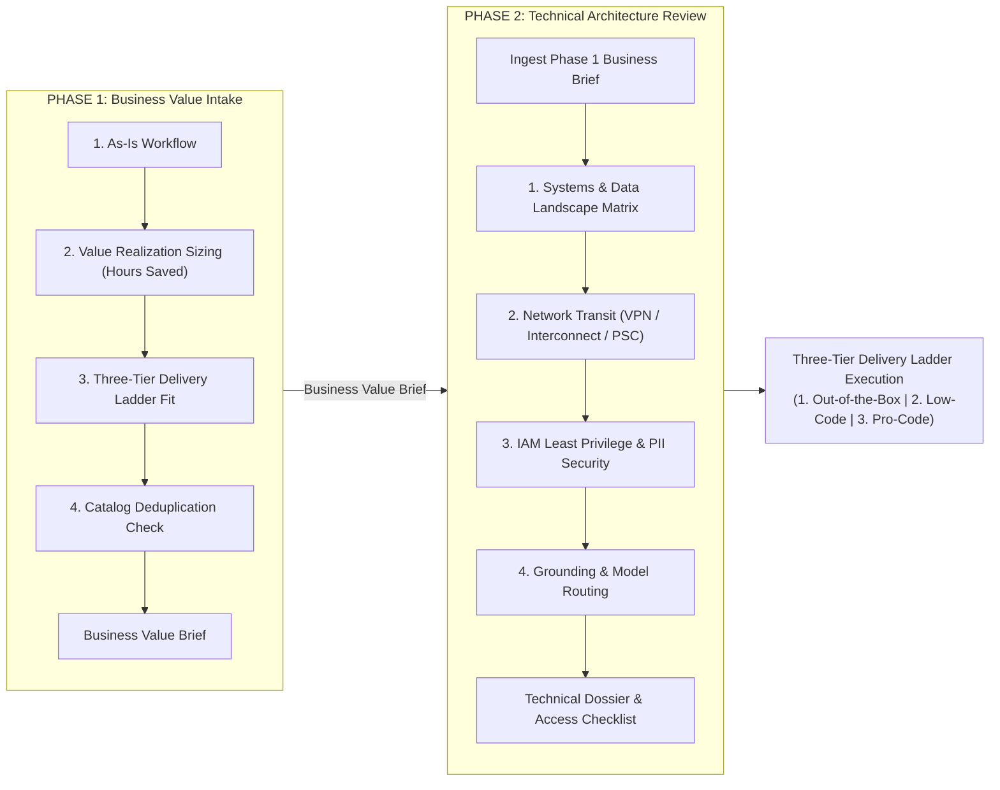
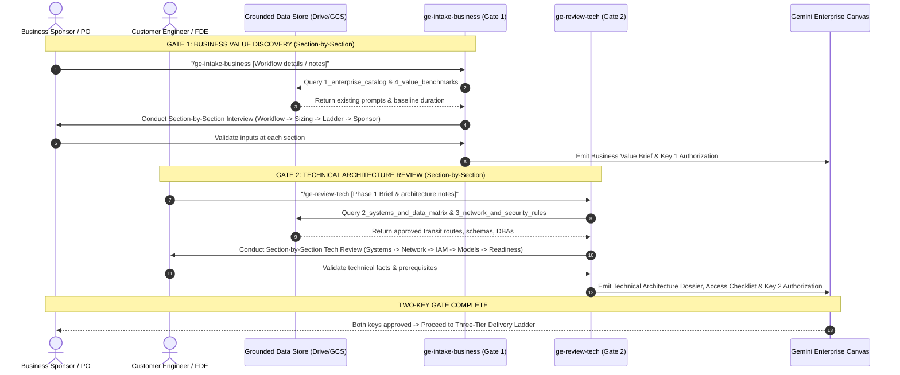

# Gemini Enterprise Opportunity Qualification Skills: Architectural Design Plan

**Document Version:** 2.2  
**Status:** Draft
**Audience:** Forward Deployed Engineers (FDE), Customer Engineers ({AI,O} CE), Solution Architects  

---

## 1. Summary

This document specifies the architecture for the **Gemini Enterprise Opportunity Qualification Skills Suite**. It equips conversational agents and coding assistants (Gemini Enterprise, Antigravity, Claude Code, and ADK multi-agent systems) with a structured, governance-backed qualification framework.

Rooted in the **Gemini Innovation Center Blueprint**, the suite implements:
1. **A Dual-Phase Operating Model:** Decouples business value discovery (Phase 1) from platform engineering review (Phase 2).
2. **Sequential Phase Handover:** Phase 2 (Technical Architecture Review) starts directly from the **Business Value Brief** generated during Phase 1. (Formal sign-off keys are omitted to simplify the workflow).
3. **The Three-Tier Delivery Ladder:** Routes validated opportunities into Out-of-the-Box, Low-Code, or Pro-Code implementation paths.
4. **Decoupled Domain Knowledge Lifecycle:** Decouples the static agent reasoning engine (`SKILL.md`) from dynamic enterprise knowledge stored in Google Drive or Google Cloud Storage.
5. **Authoritative 22-Subcriteria Audit Matrix:** Replaces coarse scoring with a 22-subcriteria evaluation across 5 technical dimensions.
6. **Consultative Coaching & Authentic Fact Preservation:** Shifts the agent from passive gatekeeper to consultative coach, offering on-demand enhanced plan synthesis while preserving 100% of authentic customer use cases and defect boundaries.
7. **Canvas-Native Markdown Scorecards:** Rejects fragile inline HTML in favor of high-density native Markdown tables, status emojis, and Unicode progress bars optimized for Gemini Enterprise Canvas and one-click Google Docs export.

---

## 2. Problem Statement & Objectives

### 2.1 Context & Challenges
Qualifying enterprise opportunities for Gemini Enterprise requires balancing business vision with technical grounding:

1. **Premature Engineering on Unsized Opportunities:** Teams often dive into technical proof-of-concepts without validating user personas, task frequency, or annualized hours saved.
2. **Catalog Duplication:** Business units frequently build redundant agents or prompt templates because they lack a catalog deduplication checkpoint.
3. **Late-Stage Technical Roadblocks:** Engineering engagements stall when unmapped hybrid networks, undocumented schemas, missing DBAs, or strict data residency bans surface late in implementation.
4. **Knowledge Store Maintenance Overhead:** Modifying, re-zipping, and re-uploading skill packages whenever database schemas, network CIDRs, or prompt templates change is operationally unsustainable.

#### 2.2 Core Objectives
- **Industrialized Intake:** Guide non-technical sponsors through value sizing and catalog deduplication in Phase 1.
- **Deep Current-State Mapping:** Systematically document systems, APIs, network routes, and IAM permissions in Phase 2.
- **Sequential Phase Handover:** Streamline discovery by having Phase 2 ingest the Phase 1 Business Value Brief as its starting point (formal sign-off keys omitted for operational simplicity).
- **Zero-Code Knowledge Maintenance:** Enable DBAs, SecOps, and business leads to update knowledge directly in Google Drive or GCS without touching skill code.
- **Runtime Portability:** Support single-file `SKILL.md` execution in native Gemini Enterprise alongside modular Python tool execution in ADK multi-agent environments.

---

## 3. Dual-Phase Qualification Framework



### 3.1 Phase 1: Business Intake & Value Discovery (`ge-intake-business`)
Operated by business sponsors, product owners, and customer engineers to establish operational demand and ROI:

| Discovery Pillar | Focus Areas | Key Questions / Actions |
| :--- | :--- | :--- |
| **1. As-Is Workflow** | Process steps, personas, operational bottlenecks, third-party data silos, source ACL governance. | How is the task executed today from trigger to completion? Who does the work? Where are the ticket queues? Does it rely on trapped data in third-party systems (Salesforce, Jira, SAP)? Must strict source-system ACLs be enforced? |
| **2. Value Realization Sizing** | User count, task frequency, manual duration, acceleration. | Computes empirical hours saved: $\text{Annual Hours} = \frac{U \times T \times M \times A \times 50}{60}$. |
| **3. Delivery Ladder Fit** | Solution complexity and customization needs. | Evaluates whether the request fits native search (Tier 1), prompt configuration (Tier 2), or custom API code (Tier 3). |
| **4. Catalog Deduplication & Handover** | Duplicate avoidance, business sponsor ownership, Phase 2 readiness. | Queries Enterprise Catalog in Drive; confirms named business sponsor; generates **Business Value Brief** for Phase 2 handover. |

### 3.2 Phase 2: Technical Architecture Review (`ge-review-tech`)
Operated by solution architects, lead engineers, and security teams starting directly from the Phase 1 Business Value Brief:

| Technical Pillar | Focus Areas | Key Questions / Actions |
| :--- | :--- | :--- |
| **0. Phase 1 Ingestion** | Intake baseline absorption. | Ingests initiative context, process, user personas, mentioned data sources, and delivery tier from Phase 1 brief. |
| **1. Systems & Data Landscape** | System inventory, hosting, APIs, schemas, data freshness. | Where does data live (on-prem, cloud, SaaS)? Are REST APIs available or direct SQL? Are schemas documented? Who is the DBA? |
| **2. Network Transit Baseline** | Hybrid connectivity, firewall barriers, routing topology. | Is transit via Cloud VPN, Dedicated Interconnect, Private Service Connect, or public HTTPS? Are egress proxies blocking traffic? |
| **3. IAM & Governance Reality** | Authentication models, service accounts, data sensitivity. | How do users and services authenticate (SSO, Kerberos, WIF)? Is data Public, Confidential, PII, or PCI? |
| **4. Grounding & Model Routing** | Retrieval boundaries, query volume, latency budgets. | What data stores ground the agent? What is expected queries per second (QPS)? Is Flash sufficient or is Pro required? |
| **5. Operational Readiness** | Handover preparation, FDE sprint kickoff. | Synthesizes As-Is Technical Dossier and Access Checklist to prepare implementation team. |

---

## 4. Governance Policies & Delivery Ladder

### 4.1 Simplified Sequential Qualification Model
To eliminate gate sign-off overhead while maintaining engineering rigor, qualification follows a direct handover pipeline:

```
┌─────────────────────────────────────────────────────────────┐
│             SEQUENTIAL QUALIFICATION PIPELINE               │
├──────────────────────────────┬──────────────────────────────┤
│ Phase 1: Business Intake     │ Phase 2: Technical Review    │
│ • Validated User Friction    │ • Ingests Phase 1 Brief      │
│ • Quantified Hours Saved     │ • Systems & APIs Mapped      │
│ • Delivery Ladder Placed     │ • Network Transit Verified   │
│ • Emits Business Value Brief │ • IAM & PII Cleared          │
└──────────────────────────────┴──────────────────────────────┘
                               │
                               ▼
        Technical Dossier & Checklist -> Delivery Ladder Build
```

#### 4.1.1 Section-by-Section Consultative Interview Architecture & Anti-Premature Conclusion Guardrail

To prevent premature conclusions and ensure high-fidelity qualification:

1. **The "Premature Conclusion" Anti-Pattern:**
   - When users provide extensive project notes, paste architectural briefs, or attach documentation upfront, automated LLM agents often jump directly to the end state: generating the final deliverable (Business Value Brief or Technical Dossier) and pronouncing conclusions on Turn 1.
   - **Why this fails:** Enterprise project documentation is frequently aspirational, incomplete, or outdated. It rarely reflects operational reality (e.g., hidden manual handoffs, undocumented database schemas, unassigned DBAs, inspecting proxies that block gRPC, or missing SLA expectations).
   - Jumping to conclusions degrades the agent from a consultative enterprise advisor into a passive, superficial summarizer.

2. **Progressive Working Draft (Template-First) Cadence:**
   - Instead of withholding the document until the final turn (which can feel opaque or trigger empty turns if the LLM stalls), the qualification follows a **Progressive Working Draft** model:
     - **Turn 1 (Draft Initialization):** The agent immediately generates the `# Business Value Brief [WORKING DRAFT]` or `# Technical Architecture Dossier [WORKING DRAFT]` artifact. It maps known facts extracted from user input into Section 1 and stamps missing sections with explicit `> ⚠️ [Pending Stage X Discovery]` tags. In that same turn, it outputs the Turn Anchor Header (`### [Stage 1 of X: ...]`) and launches the Section 1 probing questions.
     - **Intermediate Turns (Progressive Refinement):** As the stakeholder responds, the agent outputs an updated section snippet for the draft, validates assumptions, and advances to the next stage questions.
     - **Concluding Turn (Final Qualified Deliverable):** Once all stages have been reviewed, all `[Pending]` placeholders are replaced with verified facts, final calculations (e.g. Total Hours Saved, Technical Readiness Score, Feasibility Profile) are computed, and the signed-off final deliverable is emitted.
   - **Phase 1 (Business Intake - 4 Sections):**
     - *Turn 1:* Emit `# Business Value Brief [WORKING DRAFT]`, launch **Section 1: As-Is Workflow**.
     - *Turn 2:* Confirm Section 1, update Section 1 snippet in draft, launch **Section 2: Value Realization Sizing ($U, T, M$)**.
     - *Turn 3:* Confirm Section 2, update Section 2 snippet in draft, launch **Section 3: Three-Tier Delivery Ladder Fit**.
     - *Turn 4:* Confirm Section 3, update Section 3 snippet in draft, launch **Section 4: Business Sponsorship & Handover Readiness**.
     - *Turn 5 (Concluding Turn):* Emit complete, signed-off `# Business Value Brief: Final Qualified Brief [FINAL - QUALIFIED]`.
   - **Phase 2 (Technical Review - 5 Sections):**
     - *Turn 1:* Emit `# Technical Architecture Dossier [WORKING DRAFT]`, launch **Section 1: Systems & Data Landscape**.
     - *Turn 2:* Confirm Section 1, update Section 1 snippet in draft, launch **Section 2: Infrastructure & Network Baseline**.
     - *Turn 3:* Confirm Section 2, update Section 2 snippet in draft, launch **Section 3: Security, IAM Least-Privilege & Data Governance**.
     - *Turn 4:* Confirm Section 3, update Section 3 snippet in draft, launch **Section 4: Data Grounding Security & Model Routing**.
     - *Turn 5:* Confirm Section 4, update Section 4 snippet in draft, launch **Section 5: Operational Readiness & Engineering Handover**.
     - *Turn 6 (Concluding Turn):* Emit complete, signed-off `# Technical Architecture Dossier & Access Checklist: Handover Memo [FINAL]`.

3. **Sequential Ingestion & Probing Cadence:**
   - Agents ingest provided documents/text, extract what is relevant to the **active section only**, present those specific findings for confirmation, and ask focused probing questions for that specific pillar before moving forward.
   - Text or documents are treated as unverified draft inputs: findings must be explicitly validated with the user before progressing.

4. **Strict Gating for Final Deliverable Sign-Off:**
   - While the Working Draft is visible from Turn 1, final qualification verdicts, definitive delivery tiers, and overall readiness scores are strictly gated to the concluding turn (Turn 5 business, Turn 6 tech).

5. **Ported `google-agents-cli` Best Practices:**
   - **Anti-Rationalization Tables ("Shortcuts to Resist"):** Directly targets the internal temptations of LLMs to skip validation when presented with comprehensive documentation or urgent user requests.
   - **Turn Anchor Headers (`### [Stage X of Y: ...]`):** Standardized header prefixes in model responses that ground LLM attention and prevent context compaction drift across 5- to 6-turn sessions.
   - **"Always Validate" vs. "Ask Based on Context":** Separates essential validation points from situational branching probes to maintain an engaging, non-overwhelming conversational dialogue.
   - **Section Exit Criteria:** Establishes deterministic checklist milestones that must be confirmed by the stakeholder before advancing to subsequent stages.
   - **Zero-Latency Turn 1 Execution & Anti-Narration Mandate:** Mandates immediate execution on Turn 1 across both Level 1 frontmatter descriptions and Level 2 operational rules. Prohibits conversational intent narration (e.g. *"I will load the skill instructions..."*) that causes models to emit an empty filler response and stop before conducting the interview.

### 4.2 The Three-Tier Delivery Ladder

| Delivery Tier | Characteristics | Architectural Scope | Typical Use Cases |
| :--- | :--- | :--- | :--- |
| **Tier 1: Out-of-the-Box** | Standard Gemini Enterprise search and synthesis across native managed connectors. | Turnkey; zero custom code; native IAM; Google Workspace, Salesforce, BigQuery, Jira, Confluence. | Policy search, employee handbook Q&A, standard ticket search. |
| **Tier 2: Low-Code** | Tailored system instructions, Agent Builder grounding, and enterprise prompt library templates. | Configuration only; structured extraction prompts; domain-specific tone and output guidelines. | Vendor contract summarization, support ticket triage drafting. |
| **Tier 3: Pro-Code** | Multi-turn transactional logic, legacy backend mutations, and custom ADK Python microservices. | Cloud Run deployment; hybrid networking (Cloud VPN/Interconnect/PSC); custom OAuth/WIF auth. | Automated ERP order updates, claims processing, SAP mutations. |

---

## 5. Custom Domain Knowledge Lifecycle (Enterprise Drive Grounding)

To eliminate the operational friction of modifying and re-uploading `SKILL.md` packages whenever schemas or prompt libraries change, the architecture decouples **reasoning logic** from **enterprise context**:

```
┌─────────────────────────────────────────────────────────────┐
│ SKILL.md (Reasoning Engine - Static)                        │
│ - Qualification interview rubrics & discovery flow          │
│ - Value formulas & Two-Key governance logic                 │  ==> Git / Version Control
│ - Deliverable templates & Canvas integration                │      (Infrequent updates)
└─────────────────────────────────────────────────────────────┘
                             ▲
                             │ Queries at runtime via Grounding
                             ▼
┌─────────────────────────────────────────────────────────────┐
│ Grounded Data Store (Domain Knowledge Base - Dynamic)       │
│ - 1_enterprise_catalog.md (Active agents & prompt library)  │
│ - 2_systems_and_data_matrix.md (Approved backends & DBAs)   │  ==> Google Drive / GCS
│ - 3_network_and_security_rules.md (VPCs, VPNs, PII rules)   │      (Continuous team updates)
│ - 4_value_benchmarks.md (Department task baseline minutes)  │
└─────────────────────────────────────────────────────────────┘
```

### 5.1 The 4 Canonical Grounded Documents

1. **`1_enterprise_catalog.md`:** Catalog of approved prompts, active agents, and owners. Used by `ge-intake-business` for catalog deduplication.
2. **`2_systems_and_data_matrix.md`:** Inventory of production databases, schemas, API availability, and designated DBAs. Used by `ge-review-tech` to validate data feasibility.
3. **`3_network_and_security_rules.md`:** Approved VPC transit topologies, Cloud VPN routes, firewall guidelines, and PII/HIPAA data handling rules. Used by `ge-review-tech` for transit and security clearance.
4. **`4_value_benchmarks.md`:** Standard baseline task durations and target acceleration rates by department. Used by `ge-intake-business` for value sizing.

### 5.2 Retrieval Protocols & Graceful Fallback
When executing in Gemini Enterprise with an attached Google Drive or GCS store:
* **Targeted Search:** The skill searches specifically for canonical keywords (e.g., `"enterprise_catalog [workflow]"`, `"value_benchmarks [department]"`, `"systems_matrix [system]"`).
* **Graceful Fallback:** If an entity is not listed in the grounded store, the agent prompts the user in chat rather than halting or hallucinating numbers:
  * *Business:* *"No baseline found in enterprise value benchmarks. What is your team's manual duration per task?"*
  * *Tech:* *"System [System Name] is unlisted in the Enterprise Matrix. Who is the designated DBA?"*
* **Continuous Loop:** Unknowns discovered during qualification are automatically recorded in the Access Checklist to prompt knowledge store updates.

---

## 6. Repository Structure & Package Formats

The repository maintains three packaging formats to support native Gemini Enterprise UI as well as tool-augmented developer environments:

```
ge-qualify-skills/
├── README.md                              # Repository overview and operational guidelines
├── doc/
│   ├── design_plan.md                     # Architectural design plan & blueprint alignment
│   └── skill_best_practices.md            # Canonical Agent Skills standard guide
├── tests/
│   ├── eval_cases.json                    # Evaluation dataset (triggers, trajectories, rubrics)
│   ├── test_scoring.py                    # Unit tests for scoring & ROI calculations
│   ├── package_skills.py                  # Automated packager building all zip archives
│   └── run_eval.py                        # Automated evaluation runner validating all skills
├── ge_intake_business.zip                 # Standalone Front Office Business skill for Gemini Enterprise
├── ge_tech_review.zip                     # Standalone Back Office Tech skill for Gemini Enterprise
├── ge_qualify_skill.zip                   # Full modular package with Python tools
└── skills/
    ├── ge_intake_business/                # GATE 1: FRONT OFFICE BUSINESS INTAKE
    │   └── SKILL.md                       # Self-contained prompt with hours-saved formula & Canvas template
    ├── ge_tech_review/                    # GATE 2: BACK OFFICE TECHNICAL REVIEW
    │   └── SKILL.md                       # Self-contained prompt with systems matrix & Canvas template
    └── ge_qualify/                        # FULL MODULAR MULTI-AGENT FOUNDATION
        ├── SKILL.md                       # Main orchestration prompt with 5-pillar discovery
        ├── scripts/
        │   ├── calculate_score.py         # Deterministic scoring & gap analysis script
        │   └── calculate_roi.py           # Sandboxed script calculating time savings & value
        ├── references/
        │   ├── system_landscape_matrix.md     # Reference guide for backend APIs and DDLs
        │   ├── connectivity_and_security.md   # Reference guide for hybrid networking & IAM
        │   └── feasibility_indicators.md      # Reference guide for fit indicators and blockers
        └── assets/
            ├── discovery_dossier.md       # Technical handover memo template
            ├── access_checklist.md        # Technical prerequisites checklist template
            └── value_summary.md           # Business impact summary template
```

---

## 7. Operational Workflows & Sequences

### 7.1 End-to-End Two-Gate Qualification Flow



---

## 8. Deliverables & Canvas Integration

All deliverables are formatted for the **Gemini Enterprise Canvas** side-by-side markdown editor, enabling immediate review, collaborative editing, and direct export to Google Docs.

### 8.1 Front Office Deliverable: Business Value Brief & Intake Memo
Generated by `ge-intake-business` upon completion of Gate 1:
- **Executive Summary & Problem Context:** As-Is workflow, operational bottlenecks, third-party data silos, and source-system ACL requirements.
- **Value Realization Table:** Impacted user count ($U$), frequency ($T$), duration ($M$), acceleration rate ($A$), annual user hours, and team annualized hours saved.
- **Three-Tier Delivery Ladder Recommendation:** Out-of-the-Box, Low-Code, or Pro-Code with architectural rationale.
- **Catalog Deduplication Record:** Confirmation of search against `1_enterprise_catalog.md`.
- **Gate 1 Status:** Named business sponsor and **Key 1 Authorization (APPROVED/PENDING)**.

### 8.2 Back Office Deliverable: Technical Architecture Dossier & Scorecard
Generated by `ge-review-tech` upon completion of Gate 2:
- **Executive Architecture Summary:** Evaluated tier, overall readiness score, and Key 2 status badge.
- **22-Subcriteria Technical Audit Matrix:** Structured score table across all 5 dimensions.
- **Systems & Data Landscape Matrix:** Inventory of backends, hosting locations, interfaces, schemas, and DBAs.
- **Network Transit Baseline & Topology:** Transit bridge (Cloud VPN, Interconnect, PSC), proxies, and firewall lead times.
- **Security & IAM Profile:** Identity provider (Entra ID, Okta, WIF), service accounts, and data classifications.
- **Access & Prerequisite Checklist:** Prioritized action items to clear failing subcriteria before FDE kickoff.
- **Gate 2 Status:** Named lead architect and **Key 2 Authorization (APPROVED/PENDING)**.

### 8.3 The 22-Subcriteria Technical Evaluation Matrix
To ensure objective, deterministic qualification, Gate 2 evaluates 22 concrete subcriteria across 5 dimensions. Each subcriterion is scored on a 3-point scale:
- **2 Points (PASS):** Fully documented, verified, and aligned with platform standards.
- **1 Point (WARN):** Partially defined or pending operational confirmation; workable with documented risk.
- **0 Points (FAIL):** Missing, unmapped, or violates platform security/transit constraints (hard blocker).

**Maximum Score:** 44 Points.  
**Readiness Percentage:** $\text{Readiness \%} = \frac{\text{Earned Points}}{44} \times 100$.  
**Key 2 Threshold:** $\ge 80\%$ with zero 0-point blockers in Network Transit (2.4) or Data Residency (3.5).

| Dimension | Subcriterion | PASS (2 pts) | WARN (1 pt) | FAIL (0 pts) |
| :--- | :--- | :--- | :--- | :--- |
| **1. Systems & Data** | **1.1 Repository Inventory** | All production backends named | Repositories listed without editions | Backends unknown or unlisted |
| | **1.2 Programmatic Interface** | Supported REST API or native connector | Direct SQL/JDBC via proxy required | No programmatic interface or proprietary binary |
| | **1.3 Schema Documentation** | OpenAPI specs or DDL scripts available | Tables named but column schemas missing | Undocumented legacy tables |
| | **1.4 Data Freshness & SLA** | Sync SLA and freshness frequency mapped | Freshness known but sync mechanism unconfirmed | Real-time assumed without event stream |
| | **1.5 Designated DBA / Owner** | Named DBA / data custodian identified | Team queue identified without named owner | No database owner assigned |
| **2. Network Transit** | **2.1 Hosting Topology** | Cloud regions or on-prem DCs mapped | Provider identified without VPC details | Hosting location unknown |
| | **2.2 Hybrid Transit Path** | Cloud HA-VPN, Interconnect, or PSC path clear | Public HTTPS with IP whitelist planned | Transit path undefined |
| | **2.3 Egress Proxy & Firewalls** | TLS inspection and proxy ports cleared | Corporate proxy exists; ticket pending | Inspecting proxy blocks gRPC/TLS |
| | **2.4 Airgap / Transit Blockers** | Transit to Google Cloud approved | Exception process required | Airgapped system; cloud transit strictly barred |
| **3. Security & IAM** | **3.1 End-User Identity** | SAML 2.0, Okta, Entra ID, or Workspace SSO | Multiple IdPs requiring federation | Unmanaged or basic auth |
| | **3.2 Service Authentication** | Workload Identity Federation (WIF) mapped | Service account keys with vault rotation | Hardcoded long-lived static tokens |
| | **3.3 IAM Least Privilege** | Read-only scoped service identities | Broad dataset reader role proposed | Admin/owner role requested |
| | **3.4 Data Classification** | Sensitivity tagged (Public/Internal/Confidential) | Data mix unclear; review scheduled | Unclassified; potential untagged PII/PCI |
| | **3.5 Cloud Processing Policy** | Enterprise policy authorizes GCP processing | Legal review in flight | Corporate policy bans cloud data processing |
| **4. Grounding & Models** | **4.1 Document ACLs** | Connector inherits repository ACLs | Role-based group filtering required | Public access assumed on restricted documents |
| | **4.2 Citation & Provenance** | Strict source attribution required & supported | Loose attribution acceptable | Grounding unanchored |
| | **4.3 Query Volume & Latency** | Target QPS and latency SLA (<2s) mapped | Estimated volume without latency SLA | Unbounded concurrency; no SLA |
| | **4.4 Model Sizing & Routing** | Model profile justified (Flash vs Pro) | Selected model without workload sizing | Model choice arbitrary |
| **5. Operational Readiness** | **5.1 Technical Stakeholders** | Lead Architect, Cloud Eng, and SecOps named | Technical team identified without lead | No technical owners assigned |
| | **5.2 Validation SME** | Business SME committed for prompt/eval testing | Part-time SME identified | No validation resource available |
| | **5.3 GCP Landing Zone** | Target GCP Project, VPC, and base IAM provisioned | Project requested; provisioning in progress | No GCP footprint or billing account |
| | **5.4 Delivery Tier Fit** | Delivery Ladder placement justified | Tier borderline (Low-Code vs Pro-Code) | Incompatible tier selection |

---

### 8.4 Consultative Coaching & On-Demand Synthesis Mode

The qualification agent shifts from a passive gatekeeper to an active **consultative coach**:

1. **Defect Boundary Isolation:** When subcriteria score 0 or 1, the agent clearly isolates the defect boundary (why it blocks delivery, what risks it introduces).
2. **Prescriptive Guidance:** The agent delivers specific, professional remediation guidance (e.g., *"Deploy a Cloud Run microservice in the host VPC using Workload Identity Federation to mediate SQL queries instead of attempting direct client JDBC connections"*).
3. **On-Demand Plan Synthesis:** The agent offers to synthesize an upgraded, complete Technical Dossier or Business Brief incorporating remediation recommendations.
4. **Authentic Customer Grounding Guardrail:** During synthesis, the agent enforces a strict defect boundary rule:
   > **Mandatory Rule:** Preserve 100% of authentic customer use cases, existing systems, constraints, and named risks. Never replace customer-provided legacy systems with generic textbook cloud architectures. Clearly distinguish confirmed customer facts from recommended remediation additions.

---

### 8.5 Canvas Presentation Standards: Native Markdown vs. Fragile HTML

To ensure consistent rendering across Gemini Enterprise, the chat interface, the Canvas side-panel, and exported Google Docs, all deliverables strictly adhere to **Canvas-Native Markdown**:

* **Prohibition of Inline HTML:** Do **NOT** use `<details>`, `<summary>`, `<div>`, `<style>`, or custom HTML scripts. Gemini Enterprise sanitizes inline HTML for security, which strips interactive accordions, renders raw text tags, or corrupts Google Docs export.
* **Native Markdown Tables:** Use standard Markdown tables with visual status emoji badges (`✅ PASS`, `⚠️ WARN`, `❌ FAIL`).
* **Styled GitHub Callouts:** Use GitHub-style callouts (`> [!NOTE]`, `> [!IMPORTANT]`, `> [!WARNING]`, `> [!TIP]`) which Gemini Enterprise Canvas natively renders as distinct colored alert containers.
* **Unicode Progress Meters:** Render dimension and overall scores using monospace Unicode progress meters (e.g., `[████████░░] 82% (36/44 pts)`).
* **Native Mermaid Diagrams:** Render system landscapes and transit topologies using fenced `mermaid` blocks, which Canvas renders as interactive vector diagrams.

---

## 9. Implementation Roadmap & Status

- [x] **Phase 1: Architecture & Design Plan**
  - Create `doc/design_plan.md` defining discovery methodology and governance.
  - Create `doc/skill_best_practices.md` adhering to canonical Agent Skills standard.
- [x] **Phase 2: Evaluation-Driven Development (EDD) Framework**
  - Implement evaluation dataset (`tests/eval_cases.json` covering hybrid, cloud-native, airgapped, and business intake cases).
  - Implement unit tests (`tests/test_scoring.py`) and automated runner (`tests/run_eval.py`).
- [x] **Phase 3: Reference Knowledge Base**
  - Implement `skills/ge_qualify/references/system_landscape_matrix.md`.
  - Implement `skills/ge_qualify/references/connectivity_and_security.md`.
  - Implement `skills/ge_qualify/references/feasibility_indicators.md`.
- [x] **Phase 4: Output Templates & Assets**
  - Implement `discovery_dossier.md`, `access_checklist.md`, and `value_summary.md`.
- [x] **Phase 5: Sandboxed Python Scripts (Modular Foundation)**
  - Implement `calculate_score.py` (scoring, gap analysis, feasibility indicator).
  - Implement `calculate_roi.py` (hours-saved and value calculation).
- [x] **Phase 6: Core Modular Skill Orchestration**
  - Write `skills/ge_qualify/SKILL.md` orchestrating full 5-pillar discovery flow.
- [x] **Phase 7: Standalone Gemini Enterprise Skills (Dual-Pillar)**
  - Implement `skills/ge_intake_business/SKILL.md` (Gate 1 Front Office).
  - Implement `skills/ge_tech_review/SKILL.md` (Gate 2 Back Office).
- [x] **Phase 8: Decoupled Enterprise Drive Grounding Protocol**
  - Embed 4-document retrieval patterns and graceful fallbacks into standalone prompts.
- [x] **Phase 9: Automated Packaging & Verification**
  - Implement `tests/package_skills.py` building `ge_intake_business.zip`, `ge_tech_review.zip`, and `ge_qualify_skill.zip`.
  - Validate all evaluation cases via `python3 tests/run_eval.py`.
- [ ] **Phase 10: Consultative Coaching, 22-Subcriteria Scoring & Canvas Scorecard Evolution**
  - [ ] Embed the 22-subcriteria matrix into `skills/ge_tech_review/SKILL.md` with deterministic 3-point scoring (44 pts max).
  - [ ] Add consultative coaching and on-demand synthesis instructions with 100% authentic customer fact preservation.
  - [ ] Upgrade `skills/ge_qualify/scripts/calculate_score.py` to support 22 subcriteria scoring and gap classification.
  - [ ] Update `tests/test_scoring.py` and `tests/eval_cases.json` to validate 22-subcriteria calculations and coaching output.
  - [ ] Update output templates in `skills/ge_qualify/assets/` to Canvas-native high-density Markdown (scorecard tables, Unicode meters, callouts).
  - [ ] Rebuild zip bundles via `tests/package_skills.py` and verify all tests pass via `tests/run_eval.py`.
