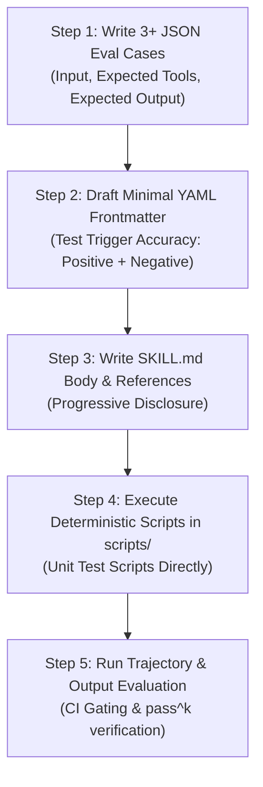

# Agent Skill Implementation Best Practices Guide

> **Standard:** Canonical Agent Skills Open Standard ([agentskills.io](https://agentskills.io))  
> **Target Audience:** Engineers and Authors implementing Skills in this repository  
> **Source Reference:** *Agent Skills* (Google Whitepaper, May 2026)

---

## 1. Bottom Line Up Front (BLUF)

Agent Skills turn any general-purpose agent into an on-demand specialist without context bloat. Instead of packing instructions into a monolithic system prompt or orchestrating heavy multi-agent pipelines for every routine task, Skills provide **modular procedural memory**:
- **Metadata (L1)** is always in context (~50 tokens).
- **Instructions (L2)** load only when the skill is triggered.
- **Resources and Scripts (L3)** load or run strictly on demand.

An agent skill without an evaluation test is a hope, not a capability. Every skill implemented in this project must follow **Evaluation-Driven Development (EDD)**: define test cases and trajectories *before* authoring the skill body.

### The One-Line Mental Model
```
System Prompt = Instinct
AGENTS.md     = Project README & Global Conventions
Tools / MCP   = Hands & Connectivity (Reach)
RAG           = Library & Semantic Knowledge
Skills        = The Runbook the experienced colleague hands you on day one
```

---

## 2. Canonical Skill Anatomy & Directory Layout

Every skill must reside in its own self-contained directory adhering to the open standard:

```
<skill_directory_name>/              # snake_case directory
├── SKILL.md                         # MANDATORY: Frontmatter + core instructions
├── scripts/                         # OPTIONAL: Deterministic code (Python, Bash)
│   ├── calculate_score.py
│   └── run_validation.py
├── references/                      # OPTIONAL: Supplementary domain knowledge & runbooks
│   ├── system_landscape_matrix.md
│   └── connectivity_and_security.md
└── assets/                          # OPTIONAL: Schemas, output templates, static resources
    ├── discovery_dossier.md
    ├── access_checklist.md
    └── value_summary.md
```

### Three Levels of Progressive Disclosure

| Level | Component | Token Impact | When Loaded | Content |
| :--- | :--- | :--- | :--- | :--- |
| **L1** | YAML Frontmatter (`name` + `description`) | ~30–80 tokens | Always active in host context | Short routing specification; triggers & anti-triggers |
| **L2** | `SKILL.md` Body | ~1,000–3,000 tokens | Only on skill match | High-level orchestration, step-by-step workflow, logic |
| **L3** | Bundled Resources (`scripts/`, `references/`, `assets/`) | 0 tokens (on disk until accessed) | As-needed during execution | Deterministic computations, reference tables, templates |

---

## 3. Naming & Description Rules

### 3.1 Naming Conventions
- **Directory name:** `snake_case` (e.g., `ge_qualify`, `bigquery_ingestion`).
- **Skill name (`name` field):** `kebab-case` (e.g., `ge-qualify-opportunity`, `processing-pdfs`).
- **Form:** Prefer gerund forms (e.g., `qualifying-opportunities`, `managing-databases`).
- **Avoid:** Generic names (`helper`, `tools`, `utils`, `data`), vendor prefixes (`gemini-*`, `claude-*`), and internal unexplained jargon.

### 3.2 The Description Field is the Routing Algorithm
The `description` in YAML frontmatter is the **only text the model sees** when deciding whether to activate the skill. Spend more time crafting this field than any other single paragraph.

**Requirements:**
1. **Action & Purpose:** Lead with what the skill does in clear verb-led sentences.
2. **Positive Triggers:** Explicitly list trigger phrases and user intentions.
3. **Negative Anti-Triggers:** Explicitly list what the skill does *not* do to prevent over-triggering.
4. **Size Bounds:** $\le$ 200 characters for API parameters; $\le$ 1,024 characters in YAML (target $\approx$ 50 words).

```yaml
---
name: ge-qualify-opportunity
description: |
  Qualifies enterprise opportunities for Gemini Enterprise by conducting structured 5-pillar technical discovery.
  Use when the user asks to qualify an opportunity, evaluate current-state systems/network/security, ingest architecture notes, or generate an As-Is Discovery Dossier and Access Checklist.
  Do NOT use for general GCP billing questions, code generation, or generic product pitch decks.
version: 1.0.0
license: Apache-2.0
allowed-tools: [Read, Bash, Write]
metadata:
  author: CE / FDE Team
---
```

---

## 4. The 5 Rules & 6 Quality Principles

### The Five Rules
1. **One skill, one job:** If you cannot describe what the skill does in one sentence without using "and" between unrelated concepts, it is two skills. Decompose before writing.
2. **Descriptions are an interface:** An imprecise description causes non-invocation (56% failure rate in production studies) or false invocations.
3. **Skills are dependencies:** Treat skills like code packages. Version them, pin them, review them via Pull Requests, and gate them with CI tests.
4. **The right team owns the right skill:** Distribute ownership to domain experts (e.g., security teams own compliance skills, merchandising owns BOM skills). Do not bottleneck on a central AI team.
5. **The agent runtime is interchangeable:** Do not bind skill logic to a single model or proprietary prompt engine. The skill must run seamlessly across Antigravity, ADK agents, and compliant CLI tools.

### The Six Quality Principles
1. **Run the task yourself first:** Real failure produces signal; speculation produces noise. Trace the workflow manually to see where base models fail.
2. **Explain the rationale, not just the rule:** Instead of shouting `"ALWAYS DO X"` or `"NEVER DO Y"` in all-caps, provide the reasoning. LLMs generalize better when they understand *why*.
3. **Every line must earn its place:** Include domain edge cases, exact CLI flags, schemas, and anti-patterns. Delete generic boilerplate the LLM already knows (e.g., "be polite and accurate").
4. **Make instructions verifiable:** If an automated test or reviewer cannot determine whether an instruction was followed, the instruction is too vague.
5. **Shift intelligence left:** Replace runtime LLM prompt guessing with deterministic code constraints in `scripts/`.
6. **Decouple state from prompt:** Never treat the LLM context window as a database. Pass pointers, filenames, or structured schema references between steps.

---

## 5. Do's, Don'ts & Skill Smells

### Summary Table

| Category | Do | Don't |
| :--- | :--- | :--- |
| **Sizing** | Keep `SKILL.md` body concise ($\le$ 2,000 tokens). Move deep runbooks to `references/`. | Write `SKILL.md` bodies over 5,000 words. |
| **Logic** | Bundle deterministic math, parsing, and data validation into `scripts/`. | Force the LLM to do raw regex, complex arithmetic, or fragile formatting in prompt text. |
| **Integrations** | Use Skills for *methodology* and MCP for *connectivity*. Combine them. | Re-implement API clients or database connectors as custom bash scripts inside the skill. |
| **Rules** | Keep global project rules (linter commands, build scripts) in `AGENTS.md`. | Duplicate repository-wide rules across individual skill definitions. |
| **Security** | Keep skills environment-agnostic; accept parameters or read configs securely. | Hardcode absolute home directories, internal IPs, API keys, or secrets. |

### Red-Flag Skill Smells (Revise Immediately If Seen)
- [ ] **Over 5,000 words:** Likely contains deep reference material that belongs in `references/`, or multiple skills glued together.
- [ ] **Two domain teams could plausibly own it:** Split along organizational ownership boundaries.
- [ ] **Cannot write 3 clear test cases:** The description or scope is too vague.
- [ ] **No external references or scripts:** May just be a prompt snippet that belongs in `AGENTS.md` rather than a standalone Skill.
- [ ] **Description begins with `"A helpful skill for..."`:** Lacks trigger keywords, inputs, outputs, and anti-triggers.

---

## 6. Evaluation-Driven Development (EDD) Workflow

Skills must be developed test-first. Invert the development order: write evaluation test cases **before** drafting the body of `SKILL.md`.



### 6.1 The Four Failure Modes to Test

1. **Trigger Failure:** The wrong skill fires, or the expected skill fails to fire. (Target: $\ge$ 90% routing accuracy).
2. **Execution Failure:** The skill triggers, but invokes wrong tools or generates incorrect outputs.
3. **Token Budget Failure:** Loading the skill exceeds token bounds or degrades performance on subsequent turns.
4. **Regression Failure:** Adding or modifying this skill degrades routing or execution in existing skills.

### 6.2 Trajectory Validation Modes (ADK / Eval Standard)

- **`ANY_ORDER`**: Tools may execute in any sequence (suitable for read-only / information retrieval skills).
- **`IN_ORDER`**: Required tools must execute in a specific order, allowing intermediate steps.
- **`EXACT`**: Exact sequence of tools and arguments required (essential for action-allowed and state-mutating workflows).

### 6.3 Standard Eval Case Schema (`eval_case.json`)

```json
{
  "case_id": "ge_qualify_hybrid_erp_001",
  "input": "We have an on-prem SAP ECC instance behind a corporate firewall and want to use Gemini Enterprise for inventory lookup.",
  "expected_skill": "ge-qualify-opportunity",
  "expected_tool_calls": [
    {
      "tool": "run_command",
      "args": {"CommandLine": "python3 scripts/calculate_score.py --input ..."}
    }
  ],
  "expected_trajectory_mode": "IN_ORDER",
  "expected_output_format": "discovery_dossier",
  "rubric": [
    "Identifies on-prem SAP as requiring custom agent integration",
    "Surfaces hybrid connectivity requirement (Cloud VPN / Interconnect)",
    "Generates structured As-Is landscape table",
    "Populates Access Checklist with network and schema prerequisites"
  ]
}
```

---

## 7. The Read / Draft / Act Governance Ladder

Every skill must be assigned an explicit tier of authority:

```
┌─────────────────────────────────────────────────────────────┐
│ 1. READ-ONLY                                                │
│    • Queries, parses, reads data                            │
│    • Cannot mutate external state                           │
│    • Gate: LLM-as-Judge eval + 90% trigger accuracy         │
├─────────────────────────────────────────────────────────────┤
│ 2. DRAFT-ONLY (Human Review Required)                       │
│    • Prepares documents, dossiers, emails, or plans         │
│    • Requires human confirmation before execution           │
│    • Gate: Golden dataset of 20+ cases + human review       │
├─────────────────────────────────────────────────────────────┤
│ 3. ACTION-ALLOWED                                           │
│    • Executes mutations, commits code, calls stateful APIs  │
│    • Gate: Full adversarial red-teaming + pass^k metric     │
│    • Requires security & domain team sign-off               │
└─────────────────────────────────────────────────────────────┘
```

> **For `ge-qualify-skill`:**  
> This skill operates at the **Draft-Only** tier. It reads customer inputs and generates discovery dossiers and access checklists for FDE and customer review. It does not execute infrastructure provisioning or direct tenant modifications.

---

## 8. Implementation & Review Checklists

Use these checklists before submitting any Skill PR or marking implementation complete.

### 8.1 Eval Coverage Checklist
- [ ] **Trigger Verification:** At least 3 positive trigger test cases and 3 negative boundary cases.
- [ ] **Execution Verification:** Evaluated with representative queries and validated tool trajectories.
- [ ] **Regression Check:** Validated that existing skills in the repository still route correctly.
- [ ] **Token Footprint Bound:** Skill body verified to be within 2,000–3,000 tokens; references kept modular.

### 8.2 Deployment & PR Checklist
- [ ] **Frontmatter Validates:** Valid YAML; contains `name`, `description`, `version`, `allowed-tools`.
- [ ] **Description Complete:** Contains what it does + when to use + when NOT to use.
- [ ] **Folder Structure Canonical:** Standard `SKILL.md`, `scripts/`, `references/`, `assets/` structure followed.
- [ ] **Scripts Tested:** Python scripts in `scripts/` have independent unit tests that pass in CI.
- [ ] **Security Clean:** Zero hardcoded credentials, access tokens, customer names, or proprietary IPs.
- [ ] **Peer / Domain Review:** Description and rubric reviewed and approved by a domain specialist.
